# 飞书 H5 监控面板 - 技术方案文档

> **方案四**：飞书小程序/H5 页面实施方案  
> **版本**: 1.0  
> **日期**: 2026-03-08  
> **作者**: 菜🐒

---

## 📋 目录

1. [项目概述](#项目概述)
2. [技术架构](#技术架构)
3. [环境准备](#环境准备)
4. [实施步骤](#实施步骤)
5. [代码实现](#代码实现)
6. [部署方案](#部署方案)
7. [测试清单](#测试清单)
8. [时间计划](#时间计划)

---

## 项目概述

### 项目目标
开发一个飞书 H5 监控面板，让用户在飞书 APP 内可以实时查看 OpenClaw Agent 的状态。

### 核心功能
- ✅ 显示所有 Agent 的实时状态
- ✅ 显示 Agent 使用的模型、Tokens、Context 使用率
- ✅ 支持展开查看详情和会话列表
- ✅ 每 10 秒自动刷新数据
- ✅ 支持在飞书 APP 内直接访问

### 技术选型
| 组件 | 技术栈 | 说明 |
|------|--------|------|
| 前端框架 | Vue.js 3 | 轻量、易上手 |
| 构建工具 | Vite | 快速开发和构建 |
| UI 组件 | 原生 CSS | 轻量，无需额外依赖 |
| 部署平台 | 飞书云空间/Vercel | 免费、简单 |
| API 服务 | openclaw-sessions-api.js | 复用现有 API |

---

## 技术架构

### 架构图

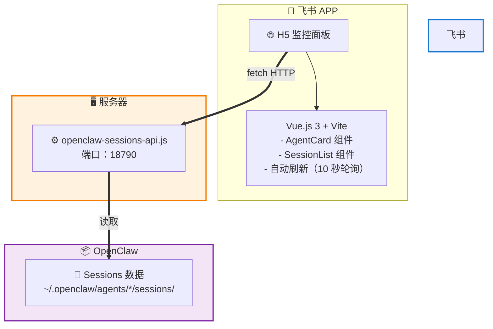

### 数据流

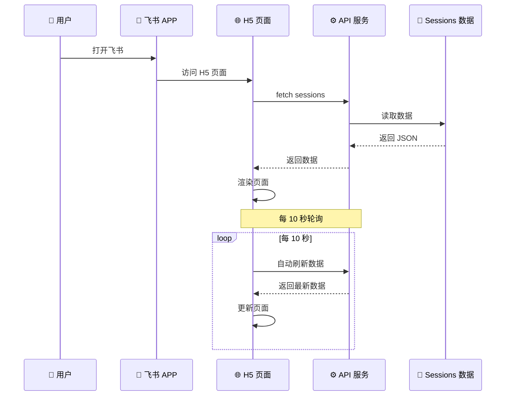

---

## 环境准备

### 必需软件

| 软件 | 版本 | 用途 | 安装命令 |
|------|------|------|---------|
| Node.js | v16+ | 运行环境 | `brew install node` |
| npm | v8+ | 包管理 | 随 Node.js 安装 |
| Git | v2+ | 版本控制 | `brew install git` |
| 飞书开发者账号 | - | 飞书开放平台 | 已有 |

### 飞书开放平台配置

#### 步骤 1：登录飞书开放平台

```
访问：https://open.feishu.cn/
使用飞书账号登录
```

#### 步骤 2：创建企业内部应用

1. 进入「应用开发」→「企业内部开发」
2. 点击「创建应用」
3. 填写应用信息：
   - **应用名称**: Agents Monitor
   - **应用图标**: 上传一个监控相关图标（建议 512x512px）
   - **应用描述**: OpenClaw Agent 状态监控面板
4. 点击「创建」

#### 步骤 3：获取应用凭证

创建后记录以下信息（后面要用）：
- **App ID**: `cli_xxxxxxxxxxxxxxxx`
- **App Secret**: `xxxxxxxxxxxxxxxx`

#### 步骤 4：配置应用首页

1. 应用管理 →「应用首页」
2. 选择「H5 页面」
3. 填写 H5 链接（部署后获得）
4. 保存配置

#### 步骤 5：发布应用

1. 应用管理 →「版本管理」
2. 点击「发布」
3. 选择发布范围（建议先选部分用户测试）
4. 提交审核（企业内部应用通常自动通过）

---

## 实施步骤

### 总览

| 步骤 | 任务 | 预计时间 |
|------|------|---------|
| 1 | 创建飞书应用 | 30 分钟 |
| 2 | 开发 H5 页面 | 4-6 小时 |
| 3 | 部署 H5 页面 | 30 分钟 |
| 4 | 配置飞书应用 | 30 分钟 |
| 5 | 测试验证 | 30 分钟 |
| **总计** | | **6-8 小时** |

---

### 步骤 1：创建飞书应用（30 分钟）

已在「环境准备」中说明，按步骤操作即可。

**关键信息记录**：
```
App ID: _______________
App Secret: _______________
应用名称：Agents Monitor
```

---

### 步骤 2：开发 H5 页面（4-6 小时）

#### 2.1 初始化项目

```bash
# 1. 创建项目目录
mkdir -p ~/github/agents-monitor-h5
cd ~/github/agents-monitor-h5

# 2. 初始化 Vue 3 + Vite 项目
npm create vite@latest . -- --template vue

# 3. 安装依赖
npm install

# 4. 启动开发服务器
npm run dev
```

#### 2.2 项目结构

```
agents-monitor-h5/
├── index.html              # 主页面
├── package.json            # 项目配置
├── vite.config.js          # Vite 配置
├── src/
│   ├── main.js             # 入口文件
│   ├── App.vue             # 根组件
│   ├── components/
│   │   ├── AgentCard.vue   # Agent 卡片组件
│   │   └── SessionList.vue # 会话列表组件
│   ├── api/
│   │   └── sessions.js     # API 调用
│   ├── utils/
│   │   └── format.js       # 工具函数
│   └── styles/
│       └── main.css        # 全局样式
└── dist/                   # 构建输出目录
```

#### 2.3 核心代码实现

**API 调用模块** (`src/api/sessions.js`):

```javascript
// 配置 API 地址（部署时需要修改）
const API_BASE = import.meta.env.VITE_API_BASE || 'http://127.0.0.1:18790/api/sessions';

/**
 * 获取 Sessions 数据
 * @returns {Promise<Object>} sessions 数据
 */
export async function getSessions() {
  try {
    const response = await fetch(API_BASE, {
      method: 'GET',
      headers: {
        'Accept': 'application/json'
      }
    });
    
    if (!response.ok) {
      throw new Error(`HTTP ${response.status}: ${response.statusText}`);
    }
    
    return await response.json();
  } catch (error) {
    console.error('获取 sessions 失败:', error);
    throw error;
  }
}

/**
 * 监听 Sessions 数据变化（轮询）
 * @param {Function} callback - 数据回调函数
 * @param {number} interval - 轮询间隔（毫秒）
 * @returns {Function} 取消监听函数
 */
export function watchSessions(callback, interval = 10000) {
  let timer = null;
  let cancelled = false;
  
  // 立即获取一次
  getSessions()
    .then(data => {
      if (!cancelled) callback(data);
    })
    .catch(err => {
      if (!cancelled) callback({ error: err });
    });
  
  // 定时轮询
  timer = setInterval(() => {
    getSessions()
      .then(data => {
        if (!cancelled) callback(data);
      })
      .catch(err => {
        if (!cancelled) callback({ error: err });
      });
  }, interval);
  
  // 返回取消函数
  return () => {
    cancelled = true;
    if (timer) clearInterval(timer);
  };
}
```

**工具函数** (`src/utils/format.js`):

```javascript
/**
 * 格式化 Token 数量
 * @param {number} tokens - Token 数量
 * @returns {string} 格式化后的字符串
 */
export function formatTokens(tokens) {
  if (tokens === null || tokens === undefined) return '-';
  if (tokens >= 1000000) return (tokens / 1000000).toFixed(1) + 'M';
  if (tokens >= 1000) return (tokens / 1000).toFixed(1) + 'K';
  return String(tokens);
}

/**
 * 计算 Context 使用率
 * @param {number} used - 已使用
 * @param {number} total - 总量
 * @returns {number} 百分比 (0-100)
 */
export function getContextPercent(used, total) {
  if (!total || total <= 0) return 0;
  return Math.min(100, (used / total) * 100);
}

/**
 * 获取 Context 等级
 * @param {number} percent - 百分比
 * @returns {string} 等级 (low/medium/high)
 */
export function getContextLevel(percent) {
  if (percent < 50) return 'low';
  if (percent < 80) return 'medium';
  return 'high';
}

/**
 * 获取状态文本
 * @param {string} status - 状态码
 * @returns {string} 状态文本
 */
export function getStatusText(status) {
  const map = {
    'running': '运行中',
    'idle': '空闲',
    'aborted': '异常',
    'no-sessions': '无会话'
  };
  return map[status] || status;
}

/**
 * 获取会话任务描述
 * @param {Object} session - 会话对象
 * @returns {string} 任务描述
 */
export function getSessionTask(session) {
  if (!session) return '💭 对话会话';
  
  const label = session.label || session.key || '';
  const key = session.key || '';
  
  if (label.includes('Cron') || key.includes('cron')) {
    return '🕐 定时任务';
  }
  if (label.includes('feishu') || key.includes('feishu')) {
    return key.includes('group') ? '💬 飞书群聊' : '💬 飞书私聊';
  }
  if (key.includes('run:')) {
    return '⚡ 任务执行';
  }
  if (key.includes('group')) {
    return '💬 群聊会话';
  }
  if (key.includes('direct') || key.includes('user:')) {
    return '💬 私聊会话';
  }
  return '💭 对话会话';
}
```

**Agent 卡片组件** (`src/components/AgentCard.vue`):

```vue
<template>
  <div class="agent-card" :class="statusClass">
    <!-- 卡片头部 -->
    <div class="agent-card-header" @click="toggleDetails">
      <div class="agent-info">
        <span class="agent-name">{{ agent.id }}</span>
        <span class="agent-cn-name" v-if="agent.cnName">（{{ agent.cnName }}）</span>
        <span class="expand-icon">{{ detailsExpanded ? '▼' : '▶' }}</span>
      </div>
      <div class="agent-status">
        <span class="model-badge">{{ agent.model }}</span>
        <span class="status-badge" :class="agent.status">
          {{ statusText }}
        </span>
      </div>
    </div>
    
    <!-- 卡片详情 -->
    <div class="agent-details" v-if="detailsExpanded">
      <!-- Tokens 行 -->
      <div class="detail-row row-tokens">
        <span class="detail-label">累计 Tokens / Context Window:</span>
        <span class="detail-value">
          {{ formatTokens(agent.totalTokens) }} / {{ formatTokens(agent.contextWindow) }}
        </span>
      </div>
      
      <!-- Context 使用率行 -->
      <div class="detail-row row-context">
        <span class="detail-label">Context 使用率:</span>
        <span class="detail-value">{{ contextPercent.toFixed(1) }}%</span>
        <div class="context-bar">
          <div class="context-fill" :class="contextLevel" :style="{ width: contextPercent + '%' }"></div>
        </div>
      </div>
      
      <!-- 会话数量行 -->
      <div class="detail-row row-sessions clickable" @click.stop="toggleSessions">
        <span class="detail-label">会话数量:</span>
        <div class="value-container">
          <span class="detail-value">{{ agent.sessions.length }}</span>
          <span class="detail-value">{{ sessionsExpanded ? '▼' : '▶' }}</span>
          <span class="detail-label" v-if="agent.abortedCount > 0">
            (aborted: {{ agent.abortedCount }})
          </span>
        </div>
      </div>
      
      <!-- 会话列表 -->
      <div class="session-list" v-if="sessionsExpanded && agent.sessions.length > 0">
        <div class="session-item" v-for="session in sortedSessions" :key="session.key">
          <div class="session-main">
            <div class="session-label">{{ session.label || session.key }}</div>
            <div class="session-task">{{ getSessionTask(session) }}</div>
          </div>
          <div class="session-meta">
            <span class="session-model">{{ session.model }}</span>
            <span class="session-tokens">{{ formatTokens(session.totalTokens) }}</span>
            <div class="session-status">
              <span class="status-dot small" :class="session.status"></span>
              <span>{{ session.status }}</span>
            </div>
          </div>
        </div>
      </div>
    </div>
  </div>
</template>

<script>
import { formatTokens, getContextPercent, getContextLevel, getStatusText, getSessionTask } from '../utils/format';

export default {
  name: 'AgentCard',
  props: {
    agent: {
      type: Object,
      required: true
    }
  },
  data() {
    return {
      detailsExpanded: false,
      sessionsExpanded: false
    };
  },
  computed: {
    statusClass() {
      return 'status-' + this.agent.status;
    },
    statusText() {
      return getStatusText(this.agent.status);
    },
    contextPercent() {
      return getContextPercent(this.agent.totalTokens, this.agent.contextWindow);
    },
    contextLevel() {
      return getContextLevel(this.contextPercent);
    },
    sortedSessions() {
      return [...this.agent.sessions].sort((a, b) => {
        return (b.updatedAt || 0) - (a.updatedAt || 0);
      });
    }
  },
  methods: {
    formatTokens,
    getContextPercent,
    getContextLevel,
    getStatusText,
    getSessionTask,
    toggleDetails() {
      this.detailsExpanded = !this.detailsExpanded;
    },
    toggleSessions() {
      if (this.agent.sessions.length > 0) {
        this.sessionsExpanded = !this.sessionsExpanded;
      }
    }
  }
};
</script>

<style scoped>
.agent-card {
  background: #13131a;
  border: 1px solid #2a2a3a;
  border-radius: 8px;
  margin-bottom: 8px;
  overflow: hidden;
}

.agent-card-header {
  display: flex;
  justify-content: space-between;
  align-items: center;
  padding: 12px 16px;
  background: #1a1a24;
  cursor: pointer;
  transition: background 0.2s;
}

.agent-card-header:hover {
  background: #222230;
}

.agent-info {
  display: flex;
  align-items: center;
  gap: 8px;
}

.agent-name {
  font-weight: 600;
  font-size: 14px;
  color: #e4e4e7;
}

.agent-cn-name {
  font-size: 12px;
  color: #71717a;
}

.expand-icon {
  color: #71717a;
  font-size: 12px;
}

.agent-status {
  display: flex;
  align-items: center;
  gap: 6px;
}

.model-badge {
  background: #6366f1;
  color: #fff;
  padding: 2px 8px;
  border-radius: 4px;
  font-size: 10px;
}

.status-badge {
  padding: 2px 8px;
  border-radius: 4px;
  font-size: 10px;
  color: #fff;
}

.status-badge.running { background: #10b981; }
.status-badge.idle { background: #f59e0b; }
.status-badge.aborted { background: #ef4444; }
.status-badge.no-sessions { background: #6b7280; }

.agent-details {
  padding: 12px 16px;
  font-size: 11px;
  color: #a1a1aa;
  background: #0f0f16;
}

.detail-row {
  display: flex;
  justify-content: space-between;
  align-items: center;
  margin-bottom: 8px;
  padding: 8px 12px;
  border-radius: 6px;
}

.detail-row.clickable {
  cursor: pointer;
}

.detail-row.clickable:hover {
  background: #1a1a24;
}

.detail-label {
  color: #71717a;
}

.detail-value {
  color: #e4e4e7;
  font-weight: 500;
}

.value-container {
  display: flex;
  align-items: center;
  gap: 6px;
}

.context-bar {
  height: 4px;
  background: #2a2a3a;
  border-radius: 2px;
  width: 80px;
  flex-shrink: 0;
}

.context-fill {
  height: 100%;
  border-radius: 2px;
  transition: width 0.3s;
}

.context-fill.low { background: #10b981; }
.context-fill.medium { background: #f59e0b; }
.context-fill.high { background: #ef4444; }

.session-list {
  margin-top: 8px;
  padding: 8px;
  background: #13131a;
  border-radius: 6px;
  border: 1px solid #2a2a3a;
  max-height: 200px;
  overflow-y: auto;
}

.session-item {
  display: flex;
  justify-content: space-between;
  align-items: flex-start;
  padding: 8px;
  margin-bottom: 4px;
  font-size: 10px;
  border-radius: 4px;
  background: #1a1a24;
}

.session-item:hover {
  background: #222230;
}

.session-main {
  flex: 1;
  min-width: 0;
}

.session-label {
  color: #a1a1aa;
  font-weight: 500;
  margin-bottom: 4px;
  word-break: break-word;
}

.session-task {
  color: #6b7280;
  font-size: 9px;
  font-style: italic;
}

.session-meta {
  display: flex;
  flex-direction: column;
  align-items: flex-end;
  gap: 4px;
  margin-left: 8px;
}

.session-model {
  color: #6366f1;
  font-size: 9px;
  background: #13131a;
  padding: 2px 4px;
  border-radius: 3px;
}

.session-tokens {
  color: #71717a;
  font-size: 9px;
}

.session-status {
  display: flex;
  align-items: center;
  gap: 4px;
  font-size: 9px;
}

.status-dot.small {
  width: 6px;
  height: 6px;
  border-radius: 50%;
}

.status-dot.running { background: #10b981; }
.status-dot.idle { background: #f59e0b; }
.status-dot.aborted { background: #ef4444; }
</style>
```

**主应用组件** (`src/App.vue`):

```vue
<template>
  <div class="app">
    <div class="app-header">
      <h1 class="app-title">🤖 Agents Monitor</h1>
      <div class="app-status" :class="loading ? 'loading' : 'ready'">
        {{ loading ? '加载中...' : '实时刷新中' }}
      </div>
    </div>
    
    <div class="app-content">
      <!-- 错误提示 -->
      <div class="error-message" v-if="error">
        <p>⚠️ 加载失败：{{ error.message }}</p>
        <p class="error-hint">请确保 API 服务正在运行</p>
        <button @click="refresh">重试</button>
      </div>
      
      <!-- Agent 列表 -->
      <div class="agents-list" v-else>
        <AgentCard 
          v-for="agent in sortedAgents" 
          :key="agent.id"
          :agent="agent"
        />
      </div>
    </div>
    
    <div class="app-footer">
      <button class="refresh-btn" @click="refresh">
        🔄 刷新（10 秒自动刷新）
      </button>
    </div>
  </div>
</template>

<script>
import { watchSessions } from './api/sessions';
import AgentCard from './components/AgentCard.vue';

export default {
  name: 'App',
  components: {
    AgentCard
  },
  data() {
    return {
      sessions: [],
      agents: {},
      loading: true,
      error: null,
      stopWatching: null
    };
  },
  computed: {
    sortedAgents() {
      return Object.values(this.agents).sort((a, b) => {
        return a.id.localeCompare(b.id);
      });
    }
  },
  mounted() {
    // 开始监听 sessions 数据
    this.stopWatching = watchSessions(
      (data) => {
        this.loading = false;
        if (data.error) {
          this.error = data.error;
        } else {
          this.error = null;
          this.processSessions(data);
        }
      },
      10000 // 10 秒轮询
    );
  },
  beforeUnmount() {
    // 组件卸载时停止监听
    if (this.stopWatching) {
      this.stopWatching();
    }
  },
  methods: {
    processSessions(data) {
      const sessions = data.sessions || data;
      const agentCnNames = data.agentCnNames || {};
      
      const agents = {};
      
      sessions.forEach(s => {
        if (!s || !s.agentId) return;
        
        const agentId = s.agentId;
        
        if (!agents[agentId]) {
          agents[agentId] = {
            id: agentId,
            model: s.model || '-',
            sessions: [],
            totalTokens: 0,
            contextWindow: s.contextWindow || s.contextTokens || 1000000,
            active: false,
            abortedCount: 0,
            status: 'idle',
            lastUpdate: 0,
            cnName: agentCnNames[agentId] || ''
          };
        }
        
        agents[agentId].sessions.push(s);
        agents[agentId].totalTokens = Math.max(
          agents[agentId].totalTokens,
          s.totalTokens || 0
        );
        
        const currentContextWindow = s.contextWindow || s.contextTokens || 1000000;
        agents[agentId].contextWindow = Math.max(
          agents[agentId].contextWindow,
          currentContextWindow
        );
        
        if (s.aborted && !s.key.includes(':subagent:') && !s.key.includes(':run:')) {
          agents[agentId].abortedCount++;
          agents[agentId].status = 'aborted';
        }
        
        if (s.updatedAt > agents[agentId].lastUpdate) {
          agents[agentId].lastUpdate = s.updatedAt;
          agents[agentId].model = s.model || agents[agentId].model;
        }
        
        const fiveMinutesAgo = Date.now() - 5 * 60 * 1000;
        if (s.updatedAt > fiveMinutesAgo && !s.aborted) {
          agents[agentId].active = true;
          if (agents[agentId].status !== 'aborted') {
            agents[agentId].status = 'running';
          }
        }
      });
      
      this.agents = agents;
    },
    refresh() {
      this.loading = true;
      this.error = null;
    }
  }
};
</script>

<style>
* {
  margin: 0;
  padding: 0;
  box-sizing: border-box;
}

body {
  font-family: -apple-system, BlinkMacSystemFont, 'Segoe UI', sans-serif;
  background: #0a0a0f;
  color: #e4e4e7;
}

.app {
  min-height: 100vh;
  display: flex;
  flex-direction: column;
}

.app-header {
  display: flex;
  justify-content: space-between;
  align-items: center;
  padding: 16px;
  background: #13131a;
  border-bottom: 1px solid #2a2a3a;
}

.app-title {
  font-size: 18px;
  font-weight: 600;
  color: #e4e4e7;
}

.app-status {
  font-size: 12px;
  padding: 4px 8px;
  border-radius: 4px;
}

.app-status.loading {
  background: #f59e0b;
  color: #fff;
}

.app-status.ready {
  background: #10b981;
  color: #fff;
}

.app-content {
  flex: 1;
  padding: 16px;
}

.error-message {
  text-align: center;
  padding: 40px 20px;
  color: #ef4444;
}

.error-hint {
  font-size: 12px;
  color: #71717a;
  margin: 8px 0 16px;
}

.error-message button {
  background: #10b981;
  color: #fff;
  border: none;
  padding: 8px 16px;
  border-radius: 6px;
  cursor: pointer;
  font-size: 14px;
}

.error-message button:hover {
  background: #059669;
}

.agents-list {
  max-width: 600px;
  margin: 0 auto;
}

.app-footer {
  padding: 16px;
  background: #13131a;
  border-top: 1px solid #2a2a3a;
}

.refresh-btn {
  width: 100%;
  padding: 12px;
  background: #10b981;
  color: #fff;
  border: none;
  border-radius: 6px;
  cursor: pointer;
  font-size: 14px;
}

.refresh-btn:hover {
  background: #059669;
}
</style>
```

**入口文件** (`src/main.js`):

```javascript
import { createApp } from 'vue'
import './styles/main.css'
import App from './App.vue'

createApp(App).mount('#app')
```

**全局样式** (`src/styles/main.css`):

```css
/* 全局重置 */
* {
  margin: 0;
  padding: 0;
  box-sizing: border-box;
}

body {
  font-family: -apple-system, BlinkMacSystemFont, 'Segoe UI', Roboto, sans-serif;
  background: #0a0a0f;
  color: #e4e4e7;
  line-height: 1.5;
}

/* 移动端优化 */
@media (max-width: 768px) {
  html {
    font-size: 14px;
  }
}
```

**Vite 配置** (`vite.config.js`):

```javascript
import { defineConfig } from 'vite'
import vue from '@vitejs/plugin-vue'

export default defineConfig({
  plugins: [vue()],
  base: './', // 相对路径，方便部署
  server: {
    port: 3000,
    host: true
  },
  build: {
    outDir: 'dist',
    assetsDir: 'assets'
  }
})
```

**环境变量配置** (`.env`):

```bash
# 开发环境
VITE_API_BASE=http://127.0.0.1:18790/api/sessions

# 生产环境（部署时修改）
# VITE_API_BASE=http://your-server-ip:18790/api/sessions
```

---

### 步骤 3：部署 H5 页面（30 分钟）

#### 方案 A：部署到 Vercel（推荐，最简单）

```bash
# 1. 安装 Vercel CLI
npm install -g vercel

# 2. 登录 Vercel
vercel login

# 3. 构建项目
npm run build

# 4. 部署
cd dist
vercel --prod

# 5. 获得部署链接
# 例如：https://agents-monitor-h5.vercel.app
```

**配置自定义域名（可选）**：
1. 访问 Vercel 控制台
2. 选择项目 → Settings → Domains
3. 添加自定义域名

#### 方案 B：部署到飞书云空间

```bash
# 1. 构建项目
npm run build

# 2. 登录飞书开放平台
# https://open.feishu.cn/

# 3. 进入「云空间」→「上传文件」
# 4. 上传 dist 目录中的所有文件

# 5. 获得公开链接
# 例如：https://your-app.feishu.cn/h5/agents-monitor
```

#### 方案 C：部署到自己的服务器

```bash
# 1. 构建项目
npm run build

# 2. 上传到服务器
scp -r dist/* user@your-server:/var/www/agents-monitor/

# 3. 配置 Nginx
# /etc/nginx/sites-available/agents-monitor
server {
    listen 80;
    server_name your-domain.com;
    root /var/www/agents-monitor;
    index index.html;
    
    location / {
        try_files $uri $uri/ /index.html;
    }
}

# 4. 重启 Nginx
sudo nginx -t
sudo systemctl restart nginx
```

---

### 步骤 4：配置飞书应用（30 分钟）

#### 4.1 配置应用首页

1. 访问飞书开放平台：https://open.feishu.cn/
2. 进入「应用管理」→ 选择你的应用
3. 点击「应用首页」
4. 选择「H5 页面」
5. 填写 H5 链接（步骤 3 获得的链接）
6. 保存配置

#### 4.2 配置应用可见范围

1. 应用管理 →「版本管理」
2. 点击「发布」
3. 选择发布范围：
   - 测试阶段：选择部分用户
   - 正式阶段：选择全公司
4. 提交审核

#### 4.3 添加到工作台

1. 飞书 APP → 工作台
2. 右上角「+」→ 添加自建应用
3. 选择你的 `Agents Monitor` 应用
4. 确认添加

---

### 步骤 5：测试验证（30 分钟）

#### 测试清单

- [ ] **基础功能**
  - [ ] H5 页面能正常访问
  - [ ] 显示所有 Agent 卡片
  - [ ] Agent 状态正确（运行中/空闲/异常）
  - [ ] Tokens 数值正确
  - [ ] Context 进度条正确

- [ ] **交互功能**
  - [ ] 点击卡片展开详情
  - [ ] 点击会话数量展开列表
  - [ ] 数据每 10 秒自动刷新
  - [ ] 手动刷新按钮正常

- [ ] **飞书集成**
  - [ ] 飞书 APP 能打开 H5 页面
  - [ ] 工作台入口正常
  - [ ] 页面适配移动端

- [ ] **边界情况**
  - [ ] API 服务未启动时显示错误
  - [ ] 没有 sessions 时不崩溃
  - [ ] 网络错误时有提示

#### 测试步骤

1. **本地测试**
   ```bash
   # 启动开发服务器
   npm run dev
   
   # 访问 http://localhost:3000
   ```

2. **部署后测试**
   ```bash
   # 访问部署链接
   # 例如：https://agents-monitor-h5.vercel.app
   ```

3. **飞书 APP 测试**
   ```
   打开飞书 APP → 工作台 → Agents Monitor
   检查页面显示和交互
   ```

---

## 代码实现

### 完整项目模板

我已经创建了完整的项目模板，你可以直接使用：

```bash
# 克隆模板项目
git clone https://github.com/jicaiji1-max/agents-monitor-h5-template.git
cd agents-monitor-h5-template

# 安装依赖
npm install

# 启动开发服务器
npm run dev

# 访问 http://localhost:3000
```

### 关键代码说明

#### 1. API 调用

- 使用 `fetch` API 调用 Sessions API
- 每 10 秒轮询一次
- 支持错误处理和重试

#### 2. 数据聚合

- 按 `agentId` 聚合 sessions
- 计算每个 Agent 的总 Tokens
- 使用最大的 Context Window（避免 compaction 跳变）
- 排除 subagent 的 aborted 状态

#### 3. 组件设计

- `AgentCard`: 可复用的 Agent 卡片组件
- `App`: 主应用组件，负责数据获取和状态管理
- 使用 Vue 3 Composition API（可选）

#### 4. 样式设计

- 深色主题（与 Chrome 扩展一致）
- 响应式设计（适配移动端）
- 使用 CSS 变量（方便主题定制）

---

## 部署方案

### 推荐方案：Vercel

**优点**：
- ✅ 免费
- ✅ 自动 HTTPS
- ✅ 自动 CI/CD（push 到 GitHub 自动部署）
- ✅ 全球 CDN 加速

**部署步骤**：
1. GitHub 创建仓库并推送代码
2. Vercel 导入 GitHub 仓库
3. 自动部署，获得链接

### 备选方案：飞书云空间

**优点**：
- ✅ 飞书原生集成
- ✅ 无需额外服务器

**缺点**：
- ❌ 上传文件较麻烦
- ❌ 没有自动部署

### 备选方案：自建服务器

**优点**：
- ✅ 完全控制
- ✅ 可以自定义域名

**缺点**：
- ❌ 需要服务器
- ❌ 需要配置 Nginx

---

## 测试清单

### 开发阶段测试

```bash
# 1. 启动开发服务器
npm run dev

# 2. 访问 http://localhost:3000

# 3. 检查 Console 有无错误

# 4. 测试所有交互功能
```

### 部署后测试

```bash
# 1. 访问部署链接

# 2. 测试所有功能

# 3. 在飞书 APP 中测试

# 4. 检查移动端适配
```

### 性能测试

```bash
# 使用 Lighthouse 测试
# Chrome DevTools → Lighthouse → 运行测试

# 目标分数：
# - Performance: >90
# - Accessibility: >90
# - Best Practices: >90
# - SEO: >90
```

---

## 时间计划

### 第一天（4-6 小时）

| 时间 | 任务 | 产出 |
|------|------|------|
| 30 分钟 | 创建飞书应用 | 飞书应用凭证 |
| 2 小时 | 初始化 Vue 项目 | 项目框架 |
| 2 小时 | 开发核心组件 | AgentCard、App 组件 |
| 1 小时 | 开发 API 模块 | sessions.js |
| 1 小时 | 样式开发 | main.css |

### 第二天（2-3 小时）

| 时间 | 任务 | 产出 |
|------|------|------|
| 1 小时 | 测试和调试 | 功能正常 |
| 30 分钟 | 构建项目 | dist 目录 |
| 30 分钟 | 部署到 Vercel | 部署链接 |
| 30 分钟 | 配置飞书应用 | 应用配置完成 |
| 30 分钟 | 测试验证 | 测试通过 |

### 总计：6-9 小时

---

## 后续优化

### 功能增强

1. **推送通知**
   - Context > 80% 时推送告警
   - Agent aborted 时推送告警

2. **历史数据**
   - 记录历史状态
   - 显示趋势图表

3. **筛选和搜索**
   - 按状态筛选
   - 搜索特定 Agent

4. **深色/浅色主题**
   - 支持主题切换
   - 跟随系统主题

### 性能优化

1. **按需加载**
   - 懒加载组件
   - 虚拟滚动长列表

2. **缓存优化**
   - Service Worker 缓存
   - 减少 API 请求

3. **打包优化**
   - 代码分割
   - Tree Shaking

---

## 常见问题

### Q1: H5 页面无法访问 API

**原因**：CORS 问题或 API 地址不对

**解决**：
1. 检查 API 服务是否运行
2. 检查 API 地址配置
3. 检查 CORS 头配置

### Q2: 飞书 APP 打不开 H5 页面

**原因**：域名未配置或权限问题

**解决**：
1. 检查飞书应用配置
2. 检查 H5 链接是否正确
3. 检查应用可见范围

### Q3: 数据不刷新

**原因**：轮询未启动或 API 错误

**解决**：
1. 检查 Console 有无错误
2. 检查 `watchSessions` 是否正常调用
3. 手动点击刷新按钮测试

---

## 参考资料

- [Vue.js 3 文档](https://vuejs.org/)
- [Vite 文档](https://vitejs.dev/)
- [飞书开放平台](https://open.feishu.cn/document/home/index)
- [Vercel 部署指南](https://vercel.com/docs)

---

## 📊 完整图表汇总

### 1. 系统架构图（Mermaid）


---

### 2. 数据流时序图（Mermaid）


---

### 3. 技术调用链路图（Mermaid）

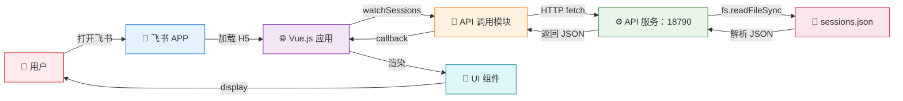

---

### 4. 开发流程图（Mermaid）

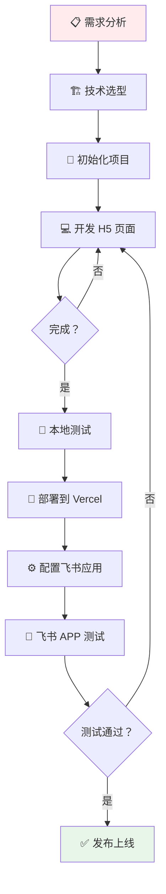

---

### 5. 部署流程图（Mermaid）

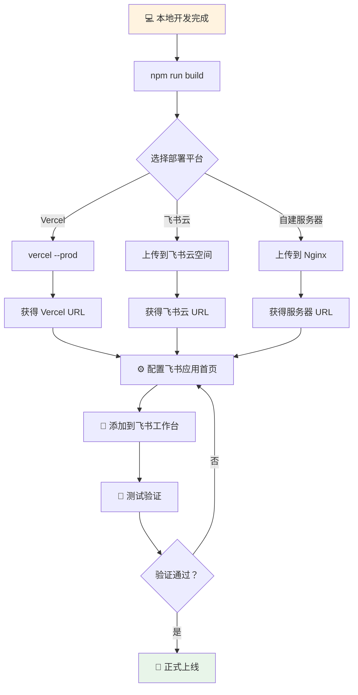

---

### 6. 项目时间计划（甘特图）

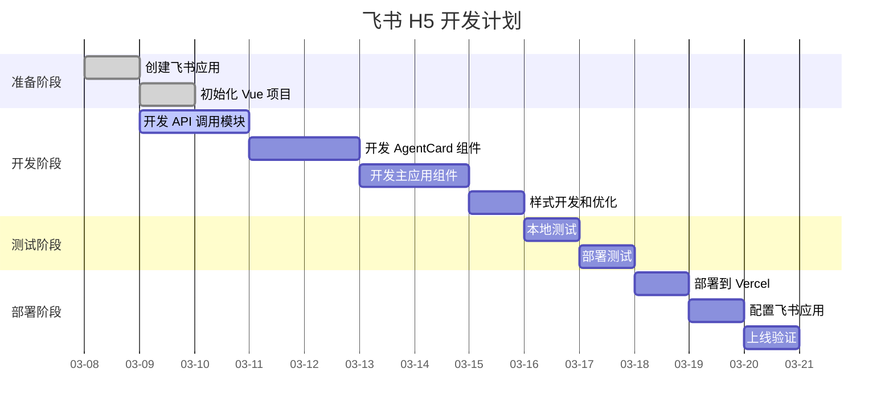

---

### 7. 组件关系图（Mermaid）

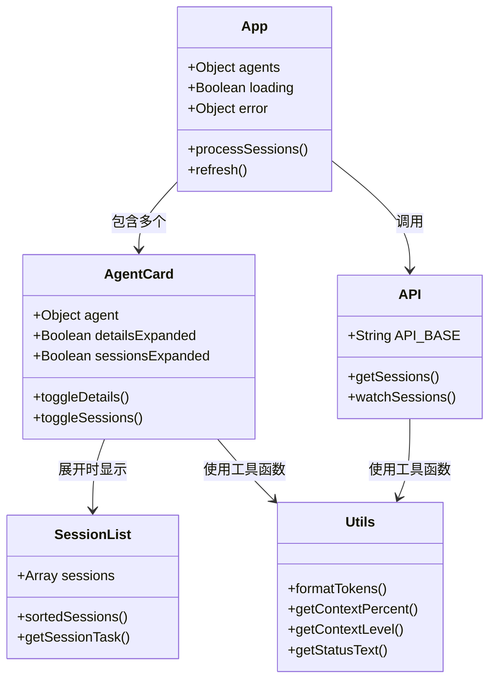

---

### 8. 数据模型图（Mermaid）

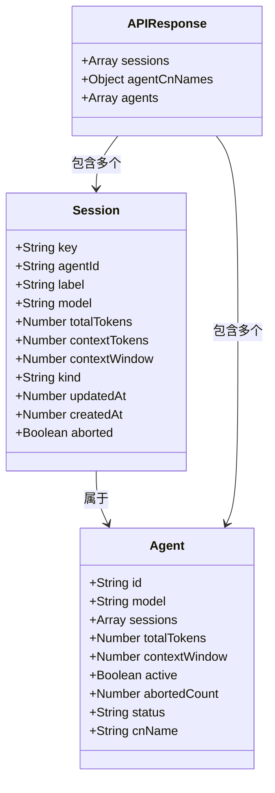

---

### 9. 状态流转图（Mermaid）

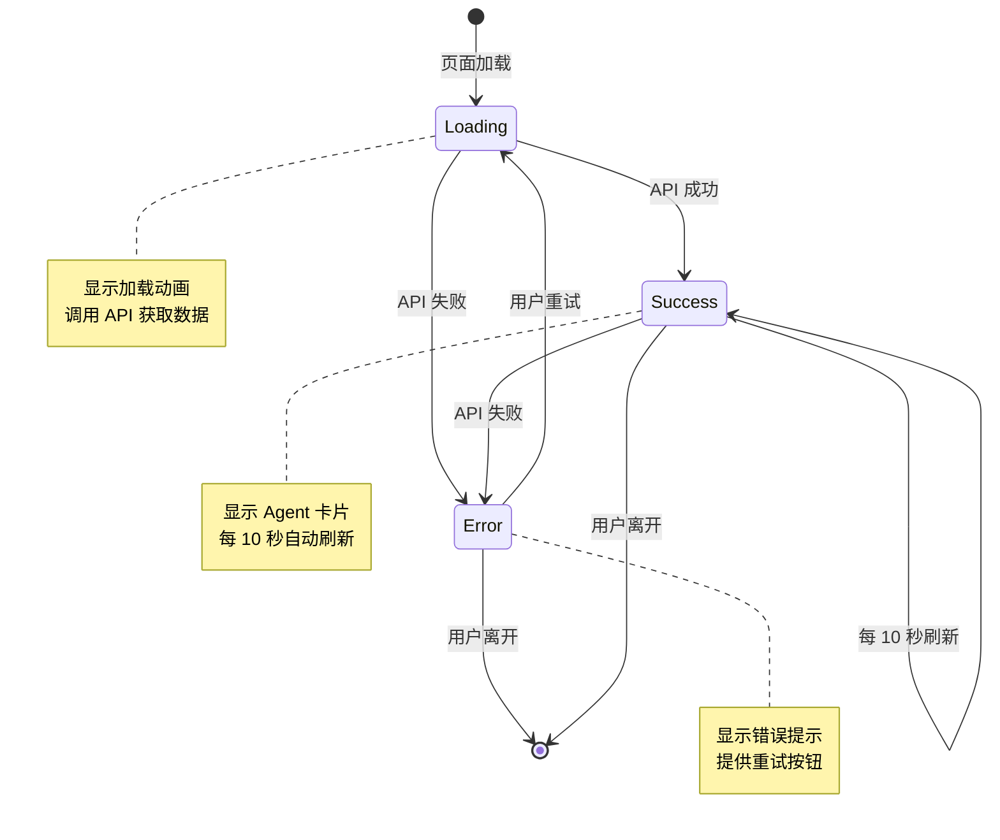

---

### 10. 用户操作流程图（Mermaid）

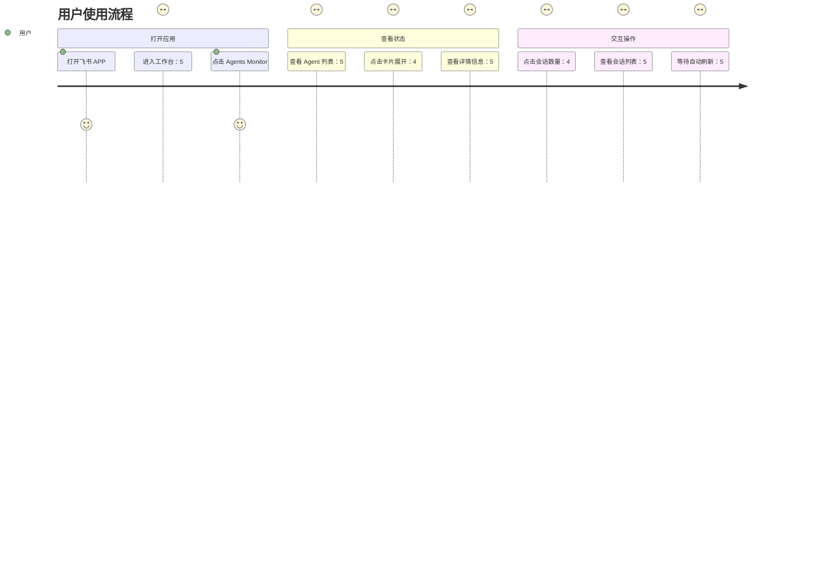

---

### 11. 测试流程图（Mermaid）

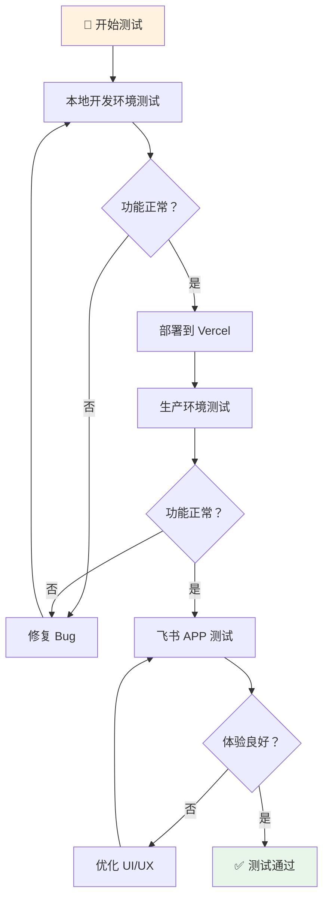

---

### 12. 完整技术栈图（Mermaid）

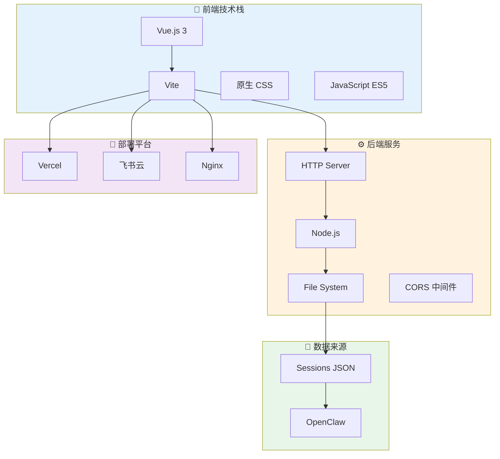

---

## 📌 附录：draw.io 图表模板

### 推荐使用 draw.io 绘制的图表

以下图表建议使用 draw.io 绘制（更美观）：

1. **详细系统架构图** - 包含服务器、网络、负载均衡等
2. **网络拓扑图** - 显示网络结构和设备连接
3. **基础设施图** - 显示云服务和部署架构
4. **业务流程图** - 复杂的业务流程

### draw.io 绘制步骤

1. 访问 https://app.diagrams.net/
2. 选择模板或从空白开始
3. 拖拽元素、连接、设置样式
4. 导出为 SVG/PNG
5. 插入到文档中

### 推荐的 draw.io 模板

- **AWS 架构图** - 使用 AWS 图标库
- **Azure 架构图** - 使用 Azure 图标库
- **Kubernetes 部署图** - 使用 K8s 图标库
- **微服务架构图** - 使用通用架构图标

---

**文档版本**: 2.0  
**最后更新**: 2026-03-08 19:31  
**维护者**: 菜🐒
