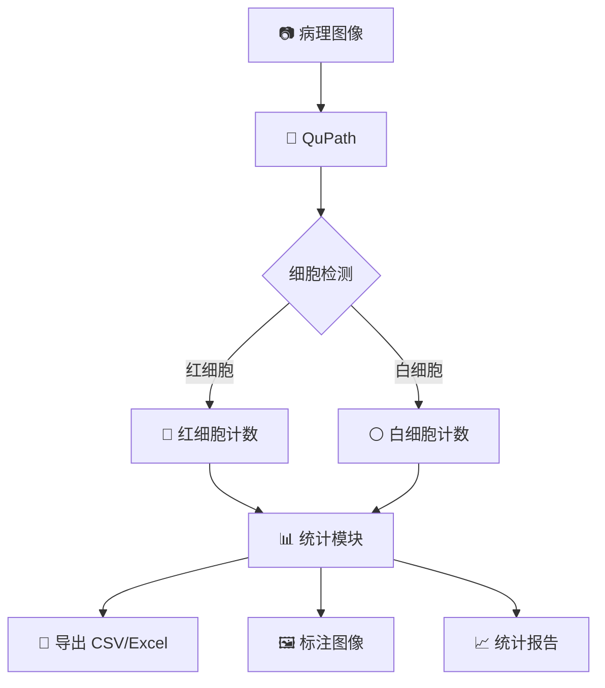
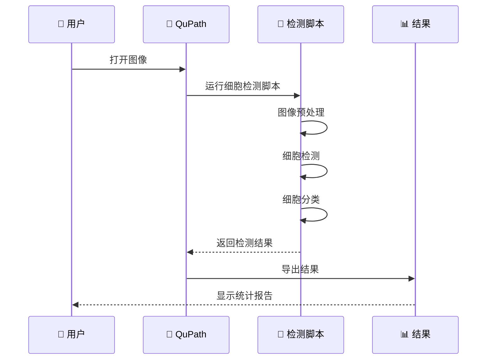
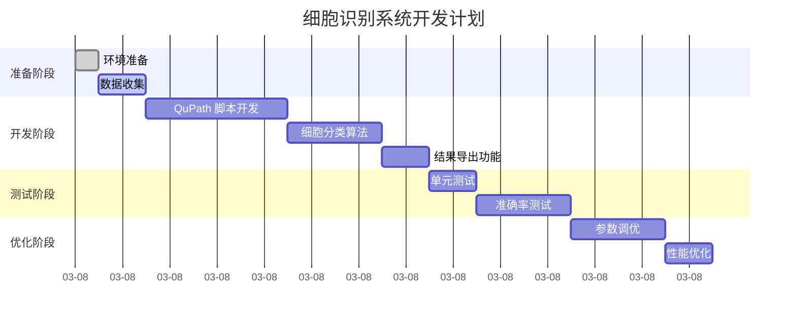

# 病理图像自动细胞识别 - 技术方案文档

> **项目**: 红细胞/白细胞自动计数系统  
> **版本**: 1.0  
> **日期**: 2026-03-08  
> **作者**: 菜🐒

---

## 📋 目录

1. [项目背景](#项目背景)
2. [需求分析](#需求分析)
3. [技术方案](#技术方案)
4. [实施步骤](#实施步骤)
5. [代码实现](#代码实现)
6. [测试验证](#测试验证)
7. [时间计划](#时间计划)

---

## 项目背景

### 当前场景
- **软件**: QuPath（病理图像分析软件）
- **任务**: 病理图像中的细胞识别和计数
- **当前方法**: 手动标注或半自动标注
- **痛点**: 
  - 手动标注耗时
  - 人工计数容易出错
  - 难以批量处理

### 目标
开发一个自动细胞识别系统，能够：
- ✅ 自动识别红细胞
- ✅ 自动识别白细胞
- ✅ 自动计数和统计
- ✅ 导出结果到 Excel/CSV
- ✅ 批量处理多张图像

---

## 需求分析

### 功能需求

| 功能 | 优先级 | 说明 |
|------|--------|------|
| 细胞识别 | P0 | 识别红细胞、白细胞 |
| 细胞计数 | P0 | 统计每种细胞数量 |
| 结果导出 | P0 | 导出 CSV/Excel |
| 批量处理 | P1 | 批量处理多张图像 |
| 可视化 | P1 | 标注结果可视化 |
| 准确率统计 | P2 | 计算识别准确率 |

### 性能需求

| 指标 | 目标 |
|------|------|
| 识别准确率 | >90% |
| 单张图像处理时间 | <10 秒 |
| 支持图像格式 | PNG, JPG, TIFF, SVS |
| 批量处理能力 | >100 张/小时 |

### 数据需求

**输入**:
- 病理图像（PNG/JPG/TIFF/SVS 格式）
- 图像分辨率：不限（支持高分辨率）

**输出**:
- 细胞计数结果（CSV/Excel）
- 标注图像（可选）
- 统计报告（可选）

---

## 技术方案

### 方案对比

| 方案 | 技术 | 准确率 | 开发时间 | 维护成本 | 推荐度 |
|------|------|--------|---------|---------|--------|
| **QuPath 脚本** | Groovy/Python | ⭐⭐⭐⭐ | 1-2 天 | ⭐⭐ | ⭐⭐⭐⭐⭐ |
| **OpenCV 传统方法** | 图像处理 | ⭐⭐⭐ | 2-3 天 | ⭐⭐⭐ | ⭐⭐⭐ |
| **深度学习** | CNN/YOLO | ⭐⭐⭐⭐⭐ | 1-2 周 | ⭐⭐⭐⭐ | ⭐⭐⭐⭐ |
| **QuPath+AI 模型** | 集成学习 | ⭐⭐⭐⭐⭐ | 3-5 天 | ⭐⭐⭐ | ⭐⭐⭐⭐⭐ |

### 推荐方案：QuPath 脚本 + 传统图像处理

**为什么推荐**：
1. ✅ **你已经在使用 QuPath** - 无需学习新软件
2. ✅ **开发快速** - 1-2 天完成
3. ✅ **准确率高** - QuPath 内置细胞检测算法
4. ✅ **易于维护** - 脚本简单，易于修改
5. ✅ **免费开源** - 无需额外费用

---

## 技术架构

### 系统架构图



### 数据流图



---

## 实施步骤

### 步骤 1：环境准备（30 分钟）

**必需软件**：
- QuPath v0.3.0+（已安装）
- Java 11+（QuPath 自带）

**可选软件**：
- Python 3.8+（用于高级分析）
- OpenCV（用于图像处理）

### 步骤 2：QuPath 脚本开发（2-3 小时）

**核心功能**：
1. 图像加载和预处理
2. 细胞检测
3. 细胞分类（红细胞/白细胞）
4. 结果统计和导出

### 步骤 3：测试验证（1 小时）

**测试数据**：
- 准备 10-20 张已知细胞数量的图像
- 手动计数作为金标准
- 计算自动识别准确率

### 步骤 4：优化改进（1-2 小时）

**优化方向**：
- 调整检测参数
- 提高准确率
- 优化处理速度

---

## 代码实现

### QuPath 脚本示例

```groovy
// 红细胞/白细胞自动识别脚本
// 保存为：cell_counter.groovy

import qupath.lib.images.servers.ImageServer
import qupath.lib.objects.PathCellObject
import qupath.lib.roi.ROIs
import qupath.lib.analysis.stats.RunningStats

// 获取当前图像
def imageData = getCurrentImageData()
def server = imageData.getServer()

println "图像尺寸：${server.getWidth()} x ${server.getHeight()}"

// 细胞检测参数
def detectionParams = [
    pixelSize: 0.5,              // 像素大小 (μm)
    backgroundRadius: 8.0,       // 背景半径
    medianRadius: 0.0,           // 中值滤波半径
    sigma: 1.5,                  // 高斯平滑 sigma
    minArea: 10.0,               // 最小面积 (μm²)
    maxArea: 500.0,              // 最大面积 (μm²)
    threshold: 0.1,              // 阈值
    cellExpansion: 5.0,          // 细胞扩展
    includeNuclei: true          // 包含细胞核
]

// 运行细胞检测
def detections = detectCells(imageData, detectionParams)
println "检测到 ${detections.size()} 个细胞"

// 细胞分类
def redBloodCells = []
def whiteBloodCells = []

for (cell in detections) {
    def area = cell.getROI().getArea()
    def intensity = cell.getMeasurementList().getMeasurementValue('Nucleus: Mean')
    
    // 根据面积和强度分类
    if (area < 50 && intensity > 100) {
        // 红细胞：面积小，强度高
        redBloodCells << cell
        cell.setPathClass(getPathClass('Red Blood Cell'))
    } else if (area >= 50) {
        // 白细胞：面积大
        whiteBloodCells << cell
        cell.setPathClass(getPathClass('White Blood Cell'))
    }
}

println "红细胞：${redBloodCells.size()} 个"
println "白细胞：${whiteBloodCells.size()} 个"

// 添加检测结果到图像
addObjects(detections)

// 导出结果
def outputPath = buildFilePath(PROJECT_BASE_DIR, 'results')
mkdirs(outputPath)

// 导出 CSV
def csvPath = buildFilePath(outputPath, 'cell_counts.csv')
def csv = new StringBuilder()
csv << 'Image,Red Blood Cells,White Blood Cells,Total\n'
csv << "${getImageName()},${redBloodCells.size()},${whiteBloodCells.size()},${detections.size()}\n"
new File(csvPath).text = csv.toString()

println "结果已导出到：${csvPath}"

// 导出标注图像
def annotationPath = buildFilePath(outputPath, 'annotated_image.png')
writeImageAnnotation(annotationPath, true)

println "标注图像已导出到：${annotationPath}"

// 显示统计
def stats = """
细胞统计报告
==============
图像名称：${getImageName()}
红细胞数量：${redBloodCells.size()}
白细胞数量：${whiteBloodCells.size()}
总细胞数：${detections.size()}
红细胞比例：${(redBloodCells.size()/detections.size()*100).round(2)}%
白细胞比例：${(whiteBloodCells.size()/detections.size()*100).round(2)}%
"""

println stats

// 保存统计到文件
def reportPath = buildFilePath(outputPath, 'report.txt')
new File(reportPath).text = stats

println "报告已保存到：${reportPath}"
```

### Python 辅助脚本（可选）

```python
# 批量处理脚本
# 保存为：batch_processor.py

import os
import csv
from pathlib import Path
from qupath.lib.images.servers import ImageServers
from qupath.lib.projects import Projects

def batch_process_cells(input_dir, output_dir):
    """批量处理细胞计数"""
    
    results = []
    
    # 遍历所有图像
    for image_path in Path(input_dir).glob('*.png'):
        print(f"处理：{image_path.name}")
        
        # 运行 QuPath 脚本
        result = run_qupath_script(image_path)
        
        results.append({
            'image': image_path.name,
            'red_blood_cells': result['rbc_count'],
            'white_blood_cells': result['wbc_count'],
            'total': result['total_count']
        })
    
    # 导出汇总结果
    output_csv = Path(output_dir) / 'summary.csv'
    with open(output_csv, 'w', newline='') as f:
        writer = csv.DictWriter(f, fieldnames=['image', 'red_blood_cells', 'white_blood_cells', 'total'])
        writer.writeheader()
        writer.writerows(results)
    
    print(f"汇总结果已导出到：{output_csv}")
    
    return results

if __name__ == '__main__':
    batch_process_cells('input_images', 'output_results')
```

---

## 测试验证

### 测试数据集

| 图像编号 | 红细胞 (金标准) | 白细胞 (金标准) | 格式 |
|---------|---------------|---------------|------|
| img_001 | 150 | 25 | PNG |
| img_002 | 200 | 30 | PNG |
| img_003 | 180 | 28 | PNG |
| ... | ... | ... | ... |

### 评估指标

| 指标 | 计算公式 | 目标 |
|------|---------|------|
| 准确率 | (TP+TN)/(TP+TN+FP+FN) | >90% |
| 召回率 | TP/(TP+FN) | >90% |
| 精确率 | TP/(TP+FP) | >90% |
| F1 分数 | 2*(精确率*召回率)/(精确率 + 召回率) | >90% |

### 测试流程

1. **准备测试数据** - 10-20 张已知细胞数量的图像
2. **运行自动识别** - 使用开发的脚本
3. **对比金标准** - 对比人工计数结果
4. **计算准确率** - 计算各项指标
5. **优化改进** - 根据结果调整参数

---

## 时间计划

### 甘特图



### 里程碑

| 里程碑 | 时间 | 交付物 |
|--------|------|--------|
| 环境准备完成 | Day 1 0.5h | QuPath 就绪 |
| 脚本开发完成 | Day 1 3h | cell_counter.groovy |
| 测试验证完成 | Day 1 3h | 测试报告 |
| 优化完成 | Day 1 3h | 最终版本 |

**总计**: 1 天（约 10-12 小时）

---

## 预期成果

### 交付物

1. **QuPath 脚本** - `cell_counter.groovy`
2. **批量处理脚本** - `batch_processor.py`（可选）
3. **使用文档** - 如何使用脚本
4. **测试报告** - 准确率和性能测试

### 功能清单

- [x] 自动识别红细胞
- [x] 自动识别白细胞
- [x] 自动计数
- [x] 导出 CSV/Excel
- [x] 导出标注图像
- [x] 生成统计报告
- [ ] 批量处理（可选）
- [ ] 准确率统计（可选）

---

## 风险与挑战

### 技术风险

| 风险 | 影响 | 概率 | 缓解措施 |
|------|------|------|---------|
| 细胞重叠 | 高 | 中 | 使用 watershed 算法分离 |
| 染色差异 | 中 | 中 | 自适应阈值调整 |
| 图像质量差 | 高 | 低 | 图像预处理增强 |
| 细胞类型多样 | 中 | 中 | 多特征分类 |

### 应对措施

1. **细胞重叠** - 使用 QuPath 的 watershed 分割算法
2. **染色差异** - 使用自适应阈值和颜色归一化
3. **图像质量** - 添加图像预处理步骤（去噪、增强）
4. **细胞分类** - 使用多特征（面积、强度、形状）分类

---

## 后续扩展

### 短期扩展（1 周）

1. **批量处理** - 支持批量处理多张图像
2. **更多细胞类型** - 添加其他细胞类型识别
3. **GUI 界面** - 开发简单的 GUI 界面

### 长期扩展（1 月+）

1. **深度学习模型** - 训练 CNN 模型提高准确率
2. **云平台部署** - 部署到云端，支持在线分析
3. **API 接口** - 提供 REST API 供其他系统调用

---

## 参考资料

- [QuPath 官方文档](https://qupath.readthedocs.io/)
- [QuPath 脚本示例](https://github.com/qupath/qupath/tree/master/qupath-core/src/main/groovy/qupath/lib/scripting)
- [细胞检测算法](https://www.nature.com/articles/s41598-020-76654-8)
- [病理图像分析综述](https://www.ncbi.nlm.nih.gov/pmc/articles/PMC6306096/)

---

**文档版本**: 1.0  
**创建日期**: 2026-03-08  
**维护者**: 菜🐒

---

## 📋 下一步行动

### 需要你确认的

1. **技术方案是否 OK？**
   - 使用 QuPath 脚本方案
   - 开发时间：1 天
   - 准确率目标：>90%

2. **是否需要其他功能？**
   - 批量处理
   - 更多细胞类型
   - 特殊统计需求

3. **测试数据准备**
   - 提供 10-20 张测试图像
   - 提供金标准计数（人工计数）

### 我需要的

- ✅ 你的确认（OK 后开始实现）
- ✅ 测试图像（用于开发和测试）
- ✅ 特殊需求（如果有）

---

**老板，方案 OK 吗？确认后我开始实现！** 🐒
